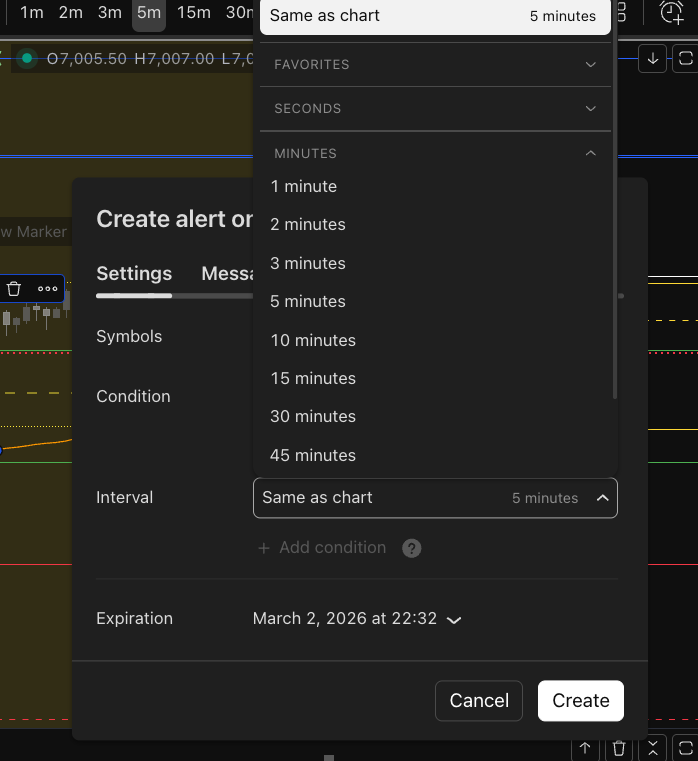
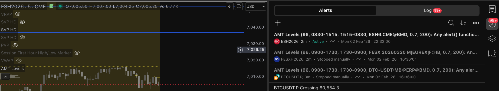

# Trading View Export Bookmap

## Description

A Python service that automates the processing of TradingView alert emails. It parses Bookmap Cloud Notes CSV payloads from alerts and exports them for local Bookmap Cloud Notes usage. The service runs on a configurable schedule (default: every 5 minutes) and can be deployed locally or via Docker.

## Features

- **Email Alert Processing**: Reads TradingView alert emails automatically, emails are deleted after processing if configured in `.env`
- **CSV Parsing**: Extracts and parses Bookmap Cloud Notes data from email payloads
- **Local Integration**: Exports notes directly to Bookmap Cloud Notes
- **Scheduled Execution**: Runs on configurable cron schedule
- **Docker Support**: Easy deployment with Docker and Docker Compose
- **Environment Configuration**: via `.env` file

## Related Project

- TradingView indicator that generates the alert payloads: https://github.com/cremissimo/Auction-Market-Theory-Indicator
- Direct link to TradingView script: https://www.tradingview.com/script/15PStzkT-Auction-Market-Theory-Levels/

## TradingView Alert Setup

This section explains how to configure TradingView alerts to work with this service.

### Prerequisites

1. **Add TradingView Indicator**: https://github.com/cremissimo/Auction-Market-Theory-Indicator
2. **Configure Gmail credentials**: 
   - Guide: https://support.google.com/mail/answer/185833?hl=en#
   - Generate app password: https://myaccount.google.com/apppasswords

### Step 1: Create an Alert

1. Open TradingView and navigate to your chart
2. Click on the three dots of the indicator to add an alert

   

### Step 2: Configure Alert Frequency

1. Set your alert frequency to 1-5 minutes
   

### Step 3: Enable Email Notification

1. Enable the "Email" checkbox

   

### Step 4: Verify Alerts are Being Triggered

Check that alerts are being triggered in TradingView:

   

### Step 5: Verify Email Alerts are Received

1. TradingView sends alerts to the email associated with your TradingView account
2. Check the service logs to confirm emails are being received and processed:
   ```bash
   docker-compose logs -f
   ```

3. Exported notes will appear in your local cloud notes directory

4. Access the notes via your configured HTTP server (default: `http://localhost:8000`) to see the exported CSV files

5. In Bookmap, add a cloud notes column and paste the URL to your notes, for example: `http://localhost:8000/ESH6.CME@BMD_STF.csv`

### Troubleshooting TradingView Alerts

- **Alerts not sending**: Verify "Email" is enabled in notification settings
- **Wrong email received**: Ensure email address matches `EMAIL_USER` in `.env`
- **Payload not parsing**: Check message format matches expected CSV structure
- **Frequent alerts**: Adjust alert conditions to reduce false positives

## Project Structure

```
.
├── __main__.py              # Main application entry point
├── src/                     # Source code directory
│   ├── __init__.py
│   └── main.py              # Core logic
├── logs/                    # Application logs
├── requirements.txt         # Python dependencies
├── docker-compose.yml       # Docker Compose configuration
├── Dockerfile              # Docker image definition
├── crontab                 # Cron schedule configuration
├── .env.example            # Environment variables template
└── README.md               # This file
```

## Quick Start

### Local Setup

1. Clone the repository:
   ```bash
   git clone <repository-url>
   cd trading_view_export_bookmap
   ```

2. Create a virtual environment:
   ```bash
   python -m venv venv
   source venv/bin/activate  # On macOS/Linux
   # or on Windows:
   # venv\Scripts\activate
   ```

3. Install dependencies:
   ```bash
   pip install -r requirements.txt
   ```

4. Configure environment variables:
   ```bash
   cp .env.example .env
   # Edit .env with your TradingView email credentials and Bookmap settings
   ```

5. Run the application:
   ```bash
   python __main__.py
   ```

### Docker Setup (Recommended)

Docker provides an isolated, reproducible environment that's ideal for running this service continuously.

#### Using Docker Compose

1. Configure environment variables:
   ```bash
   cp .env.example .env
   # Edit .env with your credentials
   ```

2. Build and start the service:
   ```bash
   docker-compose up --build -d
   ```

3. View logs:
   ```bash
   docker-compose logs -f
   ```

4. Stop the service:
   ```bash
   docker-compose down
   ```

#### Using Docker Directly

```bash
# Build the image
docker build -t trading-alerts .

# Run the container
docker run -d --name trading-alerts \
  -v $(pwd)/logs:/app/logs \
  -v $(pwd)/.env:/app/.env:ro \
  trading-alerts

# View logs
docker logs -f trading-alerts

# Stop the container
docker stop trading-alerts
```

## Configuration

### Environment Variables

Create a `.env` file (copy from `.env.example`) and configure:

- **Email credentials**: GMail credentials (app password)

Example:
```bash
# Email Configuration
EMAIL_USER=your-email@gmail.com
EMAIL_PASSWORD=your-app-password

```

### Cron Schedule

The `crontab` file controls how often the service checks for new alerts. Default is every 5 minutes:

```
*/5 * * * * /app/run.sh
```

To modify the schedule:
- Edit `crontab` file
- Rebuild Docker container: `docker-compose up --build -d`


## Usage

### Running Manually

```bash
# Using Python directly
python __main__.py
```

### Running with Docker

```bash
# Start service (runs on schedule)
docker-compose up -d

# Monitor logs
docker-compose logs -f

# Restart service
docker-compose restart

# Remove service
docker-compose down
```

## Logs

Application logs are stored in `./logs/cron.log` and contain:
- Email processing events
- CSV parsing results
- Bookmap export confirmations
- Errors and warnings

When using Docker, logs are persisted via volume mount and can be viewed with:
```bash
docker-compose logs -f
```

